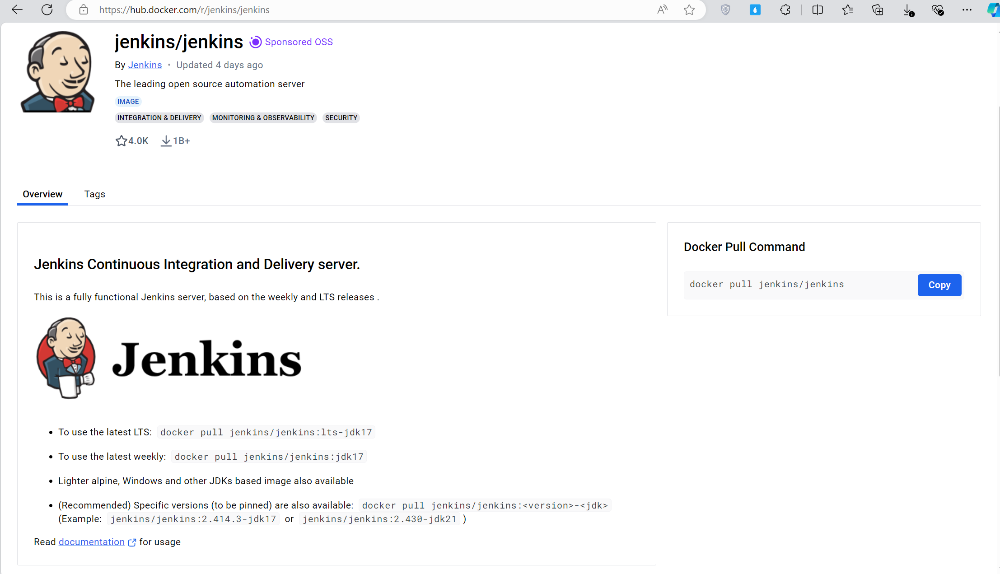
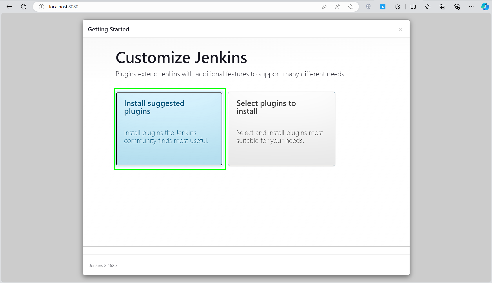
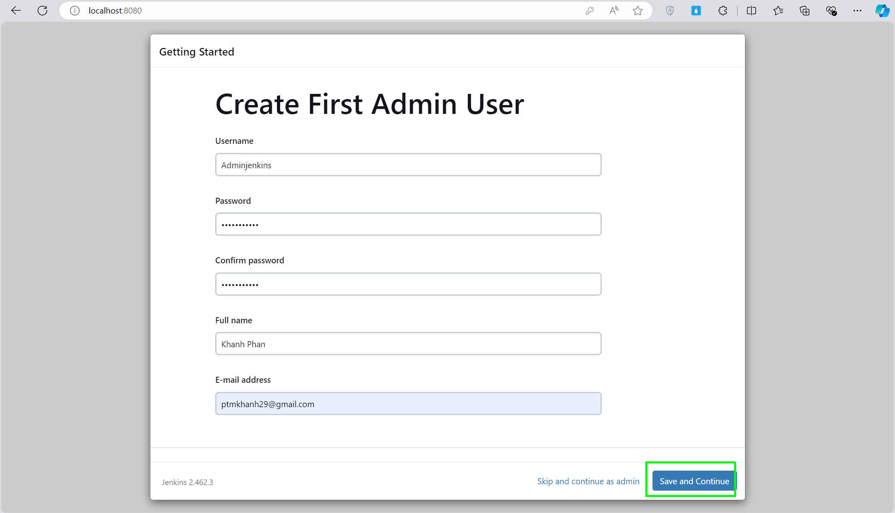
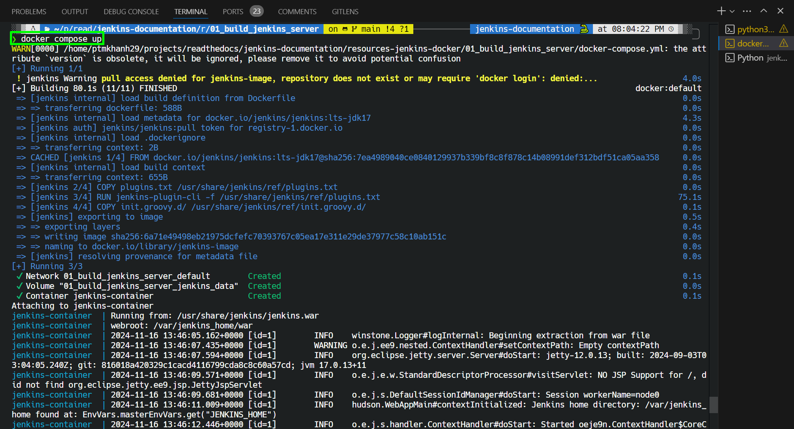
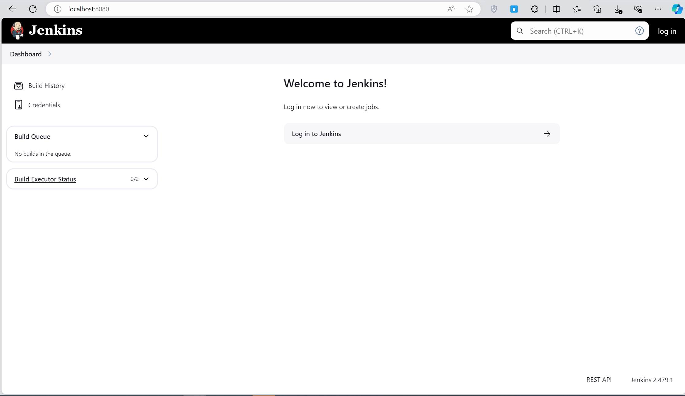
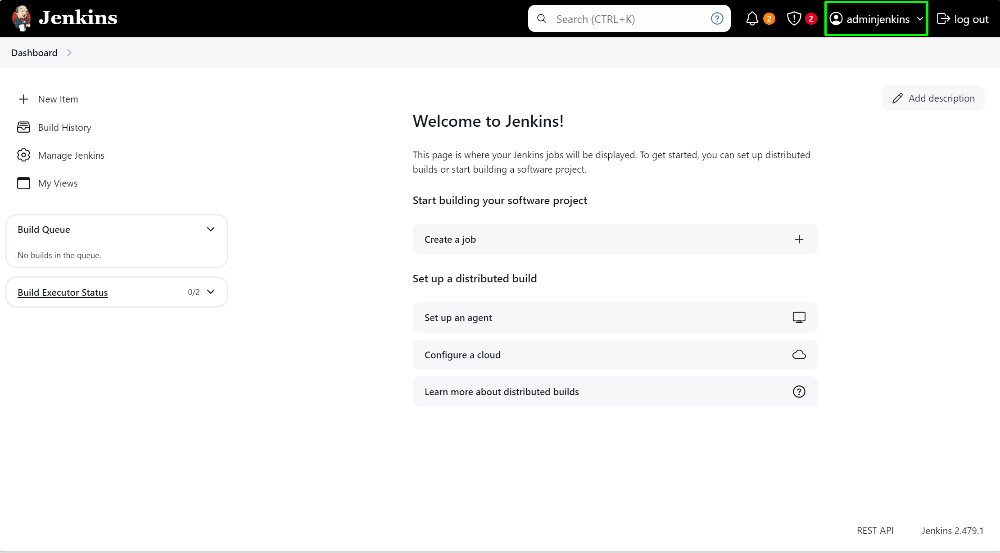

# ⚙️ Đóng gói Jenkins Server bằng Docker #

**Đặt vấn đề**: lúc mới làm Jenkins, mình có thử xây dựng Jenkins server trên máy window cá nhân do công ty cấp, tuy nhiên sau một thời gian máy có vấn đề nên mình đã liên hệ IT để đổi máy, lúc này vấn đề xảy ra là làm sao để mình move Jenkins server hiện tại trên máy cũ sang máy mới, và có một cách nào đó có thể giúp mình tiết kiệm thời gian để move server, tránh cho sau này lại phải di. Do đó, mình quyết định dùng Docker để đóng gói lại Jenkins server hiện tại của mình.

> **Tóm lại**
>
> Đôi khi có vài sự cố không mong muốn và bạn cần phải di chuyển Jenkins server sang một máy khác. Lúc này vấn đề đặt ra là làm sao setup, đồng bộ môi trường, sao lưu, khôi phục data Jenkins như máy cũ mà tốn ít thời gian và công sức nhất. Do đó mình quyết định sẽ custom lại Jenkins server bằng `docker`.
>
> Bài viết này chỉ hướng dẫn làm sao tạo container cho Jenkins từ đầu. Trong bài viết tiếp theo mình sẽ hướng dẫn làm sao di chuyển Jenkins đã có sẵn vào Docker mà vẫn bảo toàn tài nguyên, tối ưu hóa quá trình di chuyển, quản lý.

---------------------------------------------
## Nội dung chính

* Xây dựng image cho Jenkins bằng `Dockerfile`.
* Tạo và run container Jenkins với `docker-compose`.
* Sử dụng `docker volume` để backup và restore data Jenkins (job, plugins, artifact, etc.).

Giả sử, mình có cấu trúc thư mục project như sau:

```yaml
resources-jenkins-docker/
├── Dockerfile                      # Dockerfile để build image cho Jenkins
├── docker-compose.yml              # File docker-compose để run container Jenkins
├── init.groovy.d/                  # Copy các file cấu hình và script khởi tạo mặc định cho Jenkins
│   └── default-user.groovy         # Script để tạo user admin tự động
├── plugins.txt                     # File chứa các plugin cần cài đặt
└── .env                            # File chứa các biến môi trường như JENKINS_USER, JENKINS_PASS
```

---------------------------------------------
## 1. Build image cho Jenkins

Bảng bên dưới mình có resummary lại các bước cài đặt Jenkins thủ công, thông qua đó các bạn sẽ dễ hình dung khi bắt tay vào tạo Dockerfile cho Jenkins.

| Step                                    | Cài Đặt Thủ Công                                                       | Cài đặt với Docker                                               |
|---------------------------------------------|------------------------------------------------------------------------|------------------------------------------------------------------------|
| **Chuẩn Bị Môi Trường**                     | Cài đặt Java JDK.                                                     | Không cần vì Jenkins image đã có sẵn JDK.                                  |
| **Tải Về và Cài Đặt Jenkins**               | Tải file `.war` từ trang Jenkins và chạy.                            | Sử dụng Jenkins image `LTS` từ Docker Hub.                                  |
| **Cấu Hình và Khởi Động**                   | Setup Wizard để thiết lập ban đầu: nhập mật khẩu khởi tạo, cài plugins, thiết lập user admin.                                | Tắt cài đặt Setup Wizard. Cài plugins, tạo user admin tự động.      |
| **Backup dữ liệu**     | Tự setup bằng script.                                   | Định nghĩa `docker volume` trong `docker-compose.yml` để backup và restore.                 |
| **Bảo Mật và Quản Lý**                       | Cấu hình tường lửa và bảo mật.                                          | Định nghĩa các cổng sử dụng trong `Dockerfile/docker-compose.yml` file.           |

Từ những step đã mô tả ở trên, trong thư mục `resources-jenkins-docker` của mình, mình sẽ tạo một tệp có tên `Dockerfile` để định nghĩa lại những step đó như sau:

### 🚀 Dockerfile

```yaml
# Sử dụng image Jenkins LTS chính thức của Docker Hub làm base image
FROM jenkins/jenkins:lts-jdk17

# Dùng root để đảm bảo đủ quyền cấu hình các tác vụ bên dưới.
USER root

# Tắt cài đặt Wizard UI
ENV JAVA_OPTS="-Djenkins.install.runSetupWizard=false"

# Cài đặt plugin cần thiết
COPY plugins.txt /usr/share/jenkins/ref/plugins.txt
RUN jenkins-plugin-cli -f /usr/share/jenkins/ref/plugins.txt

# Define biến môi trường cho Jenkins, nó sẽ nhận 2 arguments JENKINS_USER và JENKINS_PASS
ARG JENKINS_USER
ARG JENKINS_PASS
ENV JENKINS_USER=$JENKINS_USER
ENV JENKINS_PASS=$JENKINS_PASS

# Copy thư mục init.groovy.d vào container để tạo user admin tự động.
COPY init.groovy.d/ /usr/share/jenkins/ref/init.groovy.d/

# Thay đổi user của container từ root thành jenkins để tránh rủi ro bảo mật.
USER jenkins
```
### 🔋 Giải thích chi tiết Dockerfile

**Sử dụng image Jenkins LTS** chính thức của Docker Hub làm base image.

```yaml
# Sử dụng image Jenkins LTS chính thức của Docker Hub làm base image
FROM jenkins/jenkins:lts-jdk17
```

Bạn có thể truy cập vào [Docker Hub](https://hub.docker.com/r/jenkins/jenkins) của Jenkins để tìm tên images



**⚙️ Tắt Setup Wizard UI**: Nếu bạn từng cài Jenkins thủ công trên máy rồi sẽ thấy lần đầu truy cập Jenkins qua trình duyệt nó sẽ hiển thị phần Setup Wizard. Wizard này yêu cầu bạn phải thực hiện các bước gồm: nhập mật khẩu ban đầu từ tệp `initialAdminPassword`, `cài đặt plugins` suggested hoặc custom, và thiết lập `user admin` cho Jenkins.


<p style="text-align: center; font-style: italic; font-size: 0.9em;">
    Setup Wizard yêu cầu nhập initialAdminPassword
</p>



<p style="text-align: center; font-style: italic; font-size: 0.9em;">
    Setup Wizard yêu cầu cài đặt plugins suggested hoặc tự custom
</p>



<p style="text-align: center; font-style: italic; font-size: 0.9em;">
    Setup Wizard yêu cầu tạo user admin cho Jenkins
</p>

Tuy nhiên, ở bài viết này mục đích của chúng ta là cần triển khai nhiều instance Jenkins hoặc tái tạo môi trường một cách nhanh chóng, việc tự động hóa cài đặt Jenkins mà không cần sự can thiệp thủ công là rất quan trọng, nếu không muốn nói là bước bắt buộc. Do đó mình sẽ dùng lệnh sau để tắt Setup Wizard.

```yaml
# Tắt cài đặt Wizard UI
ENV JAVA_OPTS="-Djenkins.install.runSetupWizard=false"
```

**⚙️ Cài đặt Plugin Cần Thiết Từ File plugins.txt**

**- Đầu tiên:** Cần một lệnh để COPY file `plugins.txt` từ máy host của bạn vào trong container Docker.
Thư mục `/usr/share/jenkins/ref/plugins.txt` được Jenkins sử dụng để lấy các plugin và version cần cài đặt khi container được khởi chạy lần đầu.

```yaml
COPY plugins.txt /usr/share/jenkins/ref/plugins.txt
```

**- Tiếp theo:** Thông qua công cụ `jenkins-plugin-cli` để install các plugin từ file plugins.txt trong container.
```yaml
RUN jenkins-plugin-cli -f /usr/share/jenkins/ref/plugins.txt
```

**⚙️ Tạo User Admin Tự Động Bằng Script Groovy**

Đặt biến môi trường trong Docker để lưu tên người dùng và mật khẩu cho tài khoản quản trị mà bạn muốn tự động tạo trong Jenkins.

```yaml
ENV JENKINS_USER=adminjenkins \         # Mọi người đặt lại username tùy thích
    JENKINS_PASS=password1234           # Mọi người đặt lại password tùy thích
```

Cần một lệnh `COPY` để copy thư mục `init.groovy.d` trong máy host nơi chứa các script Groovy vào container.

```yaml
COPY init.groovy.d/ /usr/share/jenkins/ref/init.groovy.d/
```

__Note:__ Thư mục `/usr/share/jenkins/ref/init.groovy.d/` là nơi Jenkins tìm kiếm các script để chạy trong quá trình khởi động. 
Các script này thực hiện các cấu hình tự động, trong trường hợp này là tạo một tài khoản admin với username và password đã được định trước.

**⚙️ Thay Đổi User Của Container (Optional)**

```yaml
# Thay đổi user của container từ root thành jenkins để tránh rủi ro bảo mật.
USER jenkins
```
Mặc định container sẽ chạy quyền `root`, do đó mình cần thay đổi từ root sang một user khác tùy thích, mình đặt là jenkins, bạn có thể đặt tên bất kì, command này giúp tăng cường bảo mật bằng cách hạn chế quyền của quá trình thực thi trong container, tránh xóa, sửa file, hay ghi vào tệp không mong muốn.

Mình cũng tạo file `default-user.groovy` để tạo user admin. (_File này mình tham khảo ở repo [admin_user.groovy](https://github.com/cinqict/jenkins-init-groovy/blob/master/init.groovy.d.examples/admin_user.groovy)_)

```javascript
import jenkins.model.*
import hudson.security.*

def instance = Jenkins.getInstance()
def hudsonRealm = new HudsonPrivateSecurityRealm(false)
hudsonRealm.createAccount(System.getenv("JENKINS_USER"), System.getenv("JENKINS_PASS"))
instance.setSecurityRealm(hudsonRealm)

def strategy = new FullControlOnceLoggedInAuthorizationStrategy()
instance.setAuthorizationStrategy(strategy)

instance.save()
```

## 2. Run container Jenkins

### 🛠️ Docker Compose

Tạo file `docker-compose.yml` với nội dung sau:

```yaml
version: '3.8'
    services:
    jenkins:
        container_name: jenkins-container       # Đặt tên cho container tùy ý
        build:
            context: .
            dockerfile: Dockerfile
            args:
                JENKINS_USER: ${JENKINS_USER}   # Truyền 2 arguments vào Dockerfile
                JENKINS_PASS: ${JENKINS_PASS}
        image: jenkins-image                    # Đặt tên cho image tùy ý             
        volumes:
            - jenkins_data:/var/jenkins_home
        restart: always
        env_file:
            - .env
        environment:
            JENKINS_USER: ${JENKINS_USER}
            JENKINS_PASS: ${JENKINS_PASS}
        ports:
            - "8080:8080"                       
            - "50000:50000"
volumes:
  jenkins_data:
```

Nội dung file `.env` để lưu các biến môi trường Jenkins, bạn có thể đặt tên và mật khẩu tùy thích.

```yaml
JENKINS_USER=adminjenkins
JENKINS_PASS=password1234
```

### 🔋 Giải thích docker-compose.yml

Trước khi mình giải thích sơ qua về dòng `volumes`, nếu bạn chưa có khái niệm nào về `Docker volume` có thể đọc qua bài viết này, mình thấy rất hay và dễ hiểu về
[Docker Volumes](https://github.com/hocchudong/ghichep-docker/blob/master/docs/docker-coban/docker-volume.md).

```yaml
volumes:
    - jenkins_data:/var/jenkins_home
```

Dòng `volumes` ở trên sẽ thiết lập một volume với tên là `jenkins_data` và gắn nó vào đường dẫn `/var/jenkins_home` bên trong `container` Jenkins. Đây là cách để dữ liệu của Jenkins được bảo toàn ngay cả sau khi container được khởi động lại hoặc bị xoá đi.

- Mở cổng 8080 để truy cập Jenkins trên web browser.

- Mở cổng 50000 để Jenkins agents có thể connect đến Jenkins master thông qua JNLP.

**Tạo file `plugins.txt` chứa các plugins cần cài đặt**

Mình có truy cập vào repo chính thức của Jenkins trên Github để tìm các plugins mà họ suggested cho user và collect nó vào file `plugins.txt`. Mọi người có thể truy cập để tham khảo [Plugins Jenkins](https://github.com/jenkinsci/jenkins/blob/master/core/src/main/resources/jenkins/install/platform-plugins.json)

```yaml
cloudbees-folder:latest
antisamy-markup-formatter:latest
build-timeout:latest
credentials-binding:latest
timestamper:latest
ws-cleanup:latest
ant:latest
gradle:latest
workflow-aggregator:latest
github-branch-source:latest
pipeline-github-lib:latest
pipeline-stage-view:latest
git:latest
ssh-slaves:latest
ssh-agent:latest
ssh-credentials:latest
matrix-auth:latest
pam-auth:latest
ldap:latest
email-ext:latest
mailer:latest
build-with-parameters:latest
extended-choice-parameter:latest
dynamic_extended_choice_parameter:latest
```
Mọi thứ cần thiết đã xong, mình sẽ dụng lệnh `docker-compose up` để tạo image và run container cho Jenkins của mình.



Sau đó, truy cập vào web browser địa chỉ [http://localhost:8080/](http://localhost:8080/) để truy cập Jenkins server



Lúc này bạn chỉ việc Login bằng account đã define trong `.env` thôi.



Okay, việc setup một Jenkins container mới tinh đến đây đã hoàn thành.