Cài Đặt Jenkins trên Linux (Debian/Ubuntu)
==========================================

Khác với Window, việc cài đặt Jenkins trên linux dễ dàng hơn nhiều, vì mình không có server Linux riêng nên tạm thời sử dụng WSL2 thay thế.

Trong bài viết này mình sẽ hướng dẫn install Jenkins theo 2 mục đích khác nhau:

**1. Cài đặt Jenkins server cho mục đích dev trên máy cục bộ (local):** này phù hợp cho những bạn chỉ muốn tìm hiểu và học Jenkins, và nó không yêu cầu truy cập Jenkins server từ máy khác.

**2. Cài đặt Jenkins server để các máy khác trong cùng mạng LAN:** phù hợp cho một team phát triển cần một open source CI/CD để các member dễ dàng truy cập và làm việc cùng nhau trên một môi trường CICD chung.

Yêu cầu tối thiểu
~~~~~~~~~~~~~~~~~~~~~~~~~~~~~~~~

**1. Môi trường Ubuntu 20.04:** phiên bản này ổn định nên mình khuyên mọi người có thể dùng nó để tránh phải fix lỗi vặt, tốn thời gian.

**2. ``User`` không phải  ``root`` nhưng có quyền sử dụng ``root``:** Bạn cần một tài khoản người dùng được cấp quyền ``sudo`` để cài đặt và cấu hình Jenkins, bởi vì quá trình cài đặt này yêu cầu các quyền hạn quản trị để thực hiện các thay đổi trên hệ thống.

**3. Cài đặt JDK**: cần cài JDK trước khi cài Jenkins.

1. Cài đặt JDK
~~~~~~~~~~~~~~~~~~~~~~~~~~~~~~~~

Jenkins được viết bằng Java nên bạn cần cài đặt Java Development Kit (JDK) hoặc Java Runtime Environment (JRE) để có thể chạy Jenkins. 
Tuy nhiên, mình sẽ cài đặt JDK (bao gồm JRE và các công cụ cần thiết) vì JDK sẽ support việc biên dịch các plugin của Jenkins, giúp dễ mở rộng system.

- Bạn nên cập nhật danh sách package trước khi cài đặt bất kì cái gì, để đảm bảo kho lưu trữ của Ubuntu luôn luôn mới nhất.

.. code-block:: bash

   sudo apt update

- Cài JDK phiên bản 17 trở lên là phù hợp, 11 cũng được nhưng mình nghĩ nên cài 17.

.. code-block:: bash

   sudo apt install openjdk-17-jre

- Kiểm tra phiên bản Java để đảm bảo cài đặt thành công.

.. code-block:: bash

   java -version

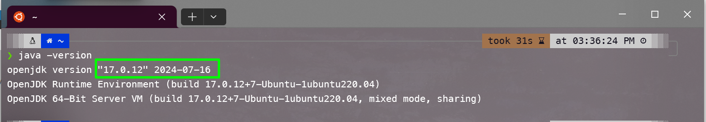

.. raw:: html

   

2. Cài đặt Jenkins
~~~~~~~~~~~~~~~~~~~~~~~~~~~~~~~~

- Đầu tiên, thêm khoá GPG của Jenkins vào hệ thống của bạn.

.. code-block:: bash

   curl -fsSL https://pkg.jenkins.io/debian-stable/jenkins.io-2023.key | sudo tee \
   /usr/share/keyrings/jenkins-keyring.asc > /dev/null

- Sau đó, thêm đường dẫn kho lưu trữ Jenkins vào ``sources.list`` của máy.

.. code-block:: bash

   echo "deb [signed-by=/usr/share/keyrings/jenkins-keyring.asc] \
   https://pkg.jenkins.io/debian-stable binary/" | sudo tee \
   /etc/apt/sources.list.d/jenkins.list > /dev/null

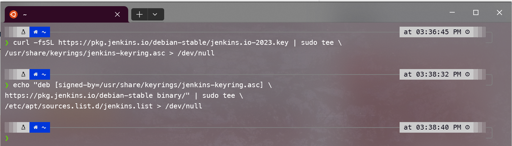

.. raw:: html

   

- Chạy lại lệnh apt để cập nhật lại danh sách gói, để apt sử dụng kho lưu trữ mới.

.. code-block:: bash

   sudo apt-get update

3. Start service Jenkins
~~~~~~~~~~~~~~~~~~~~~~~~~~~~~~~~

- Tiếp theo, máy đã đủ điều kiện để cài đặt Jenkins

.. code-block:: bash

   sudo apt-get install jenkins

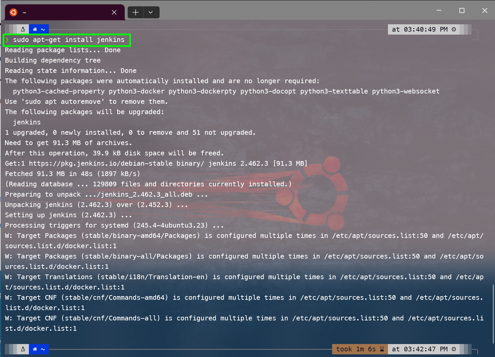

.. raw:: html

   

- Sau khi cài xong, bạn cần khởi động service Jenkins

.. code-block:: bash

   sudo systemctl start jenkins.service

- Bạn có thể chạy thêm lệnh này để cấu hình hệ thống tự động khởi động service Jenkins mỗi khi máy được khởi động lại.

.. code-block:: bash

   sudo systemctl enable jenkins.service

- Kiểm tra trạng thái service hiện tại của Jenkins

.. code-block:: bash

   sudo systemctl status jenkins

Nếu bạn thấy ``Active: active (running)`` như ảnh thì nghĩa là service của Jenkins đã được khởi động thành công và đang chạy.

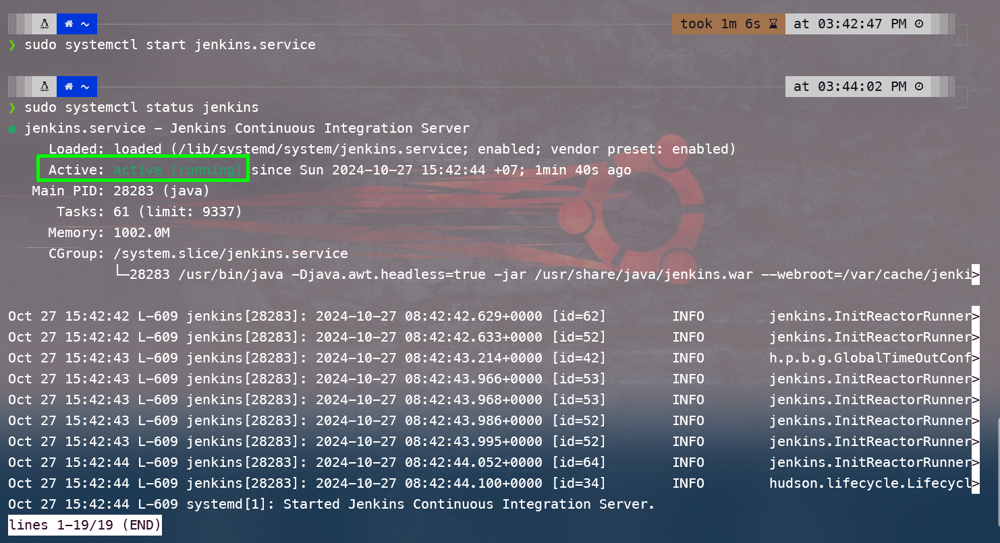

.. raw:: html

   

4. Cấu hình tường lửa Firewall 
~~~~~~~~~~~~~~~~~~~~~~~~~~~~~~~~

.. warning::
    ``Bạn có thể bỏ qua bước này nếu bạn chỉ cần chạy và truy cập Jenkins ở local của mình.``

   **Mục đích:** chỉ định rõ ràng những địa chỉ IP hoặc phạm vi địa chỉ mà được phép truy cập Jenkins server, 
   đồng thời chặn tất cả các request không mong muốn hoặc tiềm ẩn nguy hiểm từ bên ngoài.

- Đầu tiên, bạn cần kiểm tra xem ufw đã được kích hoạt trên hệ thống của bạn chưa bằng lệnh

.. code-block:: bash

   sudo ufw status

Nếu kết quả hiển thị là ``inactive`` như ảnh, điều đó có nghĩa là tường lửa chưa được kích hoạt.

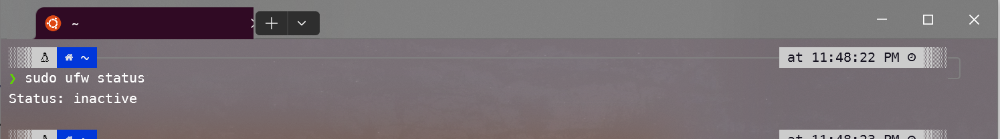

.. raw:: html

   

- Nếu ``ufw`` chưa được kích hoạt, bạn cần kích hoạt nó trước khi thêm các quy tắc. Kích hoạt ``ufw`` bằng lệnh

.. code-block:: bash

   sudo ufw enable

- Mặc định, Jenkins chạy trên port 8080. Mở port đó bằng ufw (Uncomplicated Firewall):

.. code-block:: bash

   sudo ufw allow 8080

.. warning::
   Lệnh trên sẽ cấu hình tường lửa để cho phép tất cả các kết nối đến port 8080, điều này phù hợp nếu Jenkins của bạn sẽ nhận kết nối từ mọi địa chỉ IP.

- Sau khi đã thêm quy tắc, bạn có thể xác nhận lại bằng cách kiểm tra trạng thái của ufw:

.. code-block:: bash

   sudo ufw status

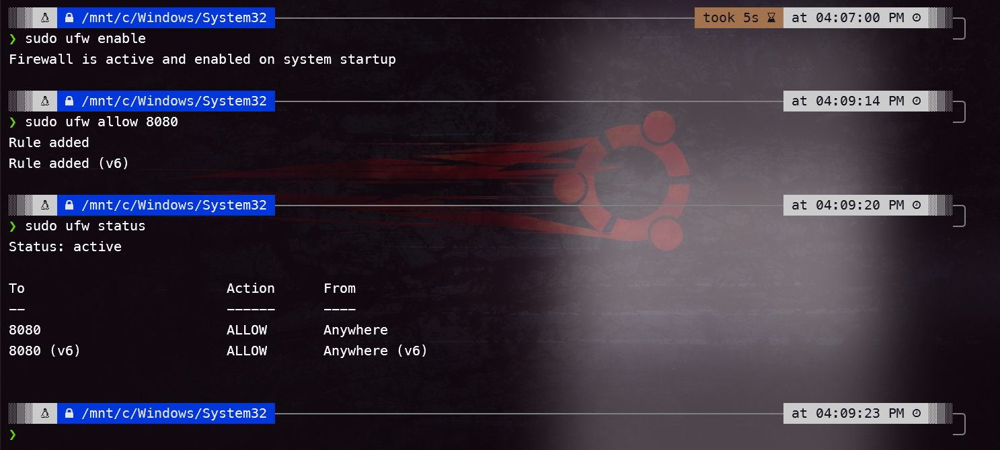

- Sau khi cấu hình tường lửa, hãy truy cập vào Jenkins qua trình duyệt tại địa chỉ:

.. code-block:: bash

   http://<địa-chỉ-ip-của-máy-chủ>:8080

5. Thiết lập ban đầu cho Jenkins
~~~~~~~~~~~~~~~~~~~~~~~~~~~~~~~~

- Bây giờ, bạn có thể truy cập Jenkins qua trình duyệt web của mình tại địa chỉ 
``<http://<địa chỉ IP của máy chủ>:8080>`` hoặc `http://localhost:8080 <http://localhost:8080>`_.

- Tuy nhiên, lần đầu truy cập các bạn sẽ phải ``Unlock Jenkins``. Như ảnh bên dưới các bạn sẽ cần nhập Administrator password.

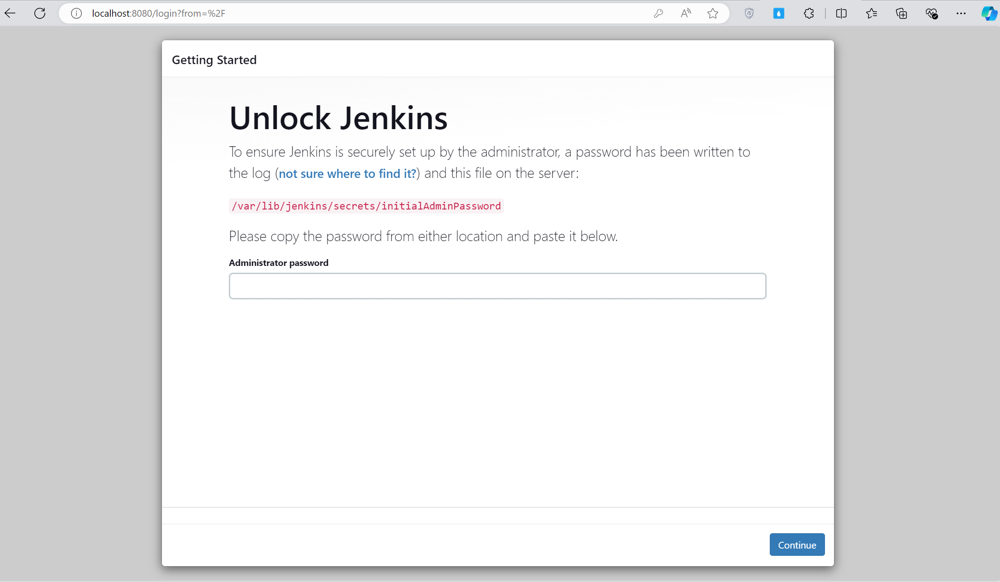

.. raw:: html

   

.. tip:: Bạn có thể sử dụng lệnh này để lấy mật khậu khởi tạo ban đầu, lưu ý dùng ``sudo`` để tránh bị lỗi Access denied.

.. code-block:: bash

   sudo cat /var/lib/jenkins/secrets/initialAdminPassword

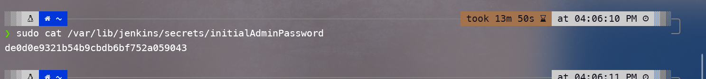

.. raw:: html

   

- Lựa chọn cài đặt plugin đề xuất sẵn hoặc chọn các plugin cụ thể, ở đây mình nghĩ các bạn nên chọn ``Install suggested plugins`` để tránh gặp lỗi.

.. image:: images/install_linux/install_linux_8.png
   :alt: Get password
   :width: 100%
   :align: center

.. raw:: html

   

- Chờ đợi Jenkins tự install plugin

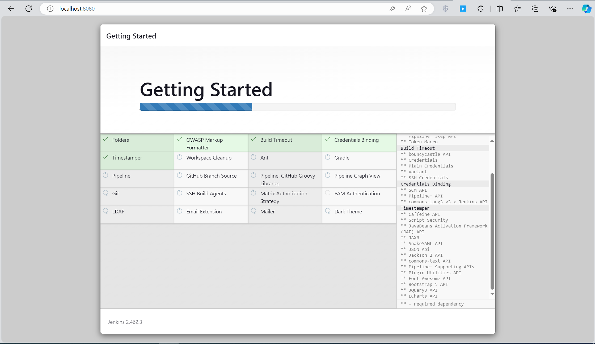

.. raw:: html

   

- Sau khi quá trình cài đặt pluigin hoàn tất, bạn cần tạo user admin. Cứ tạo theo ý mình thích thôi.

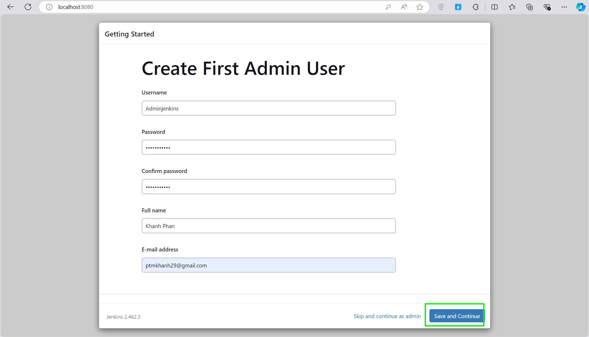

.. raw:: html

   

- Thiết lập URL cho instance Jenkins của bạn. Trong trường hợp này, URL mặc định là http://localhost:8080/, đây là URL dùng để truy cập Jenkins trên máy local.

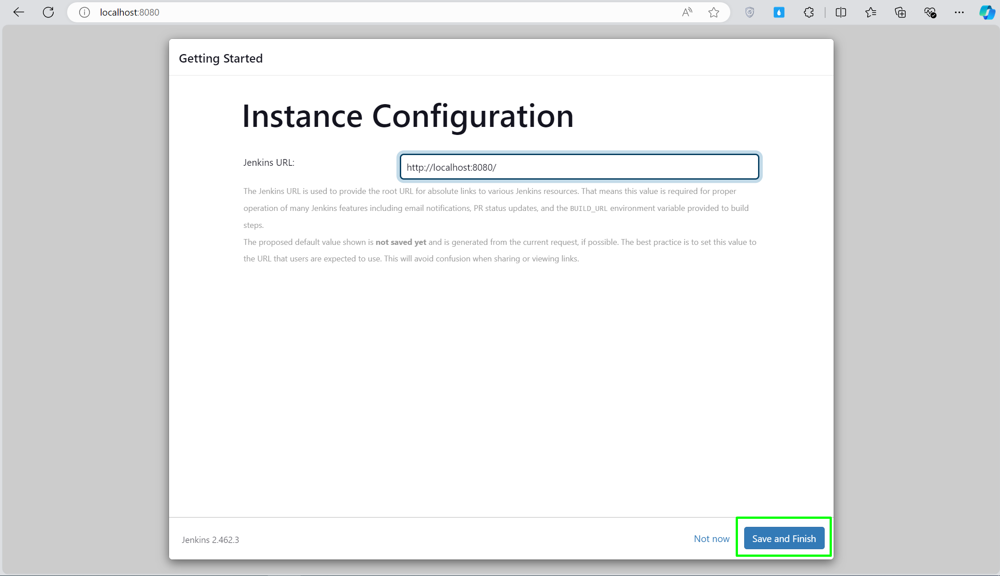

.. raw:: html

   

Sau đó nhấp vào ``Save and Finish``, nhấn ``Start using Jenkins`` để hoàn thành cài đặt.

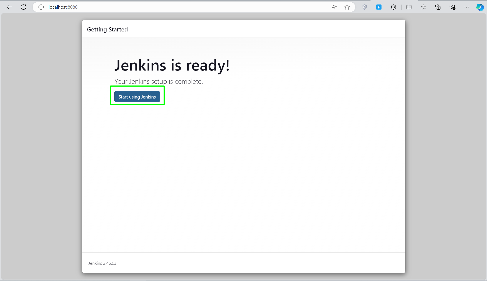

.. raw:: html

   

- Như vậy, quá trình cài đặt và thiết lập ban đầu cho Jenkins đã xong. Bạn có thể tiến hành tạo job và pipeline cho riêng mình.

.. image:: images/install_linux/install_linux_13.png
   :alt: Finish
   :width: 100%
   :align: center

.. raw:: html

   

