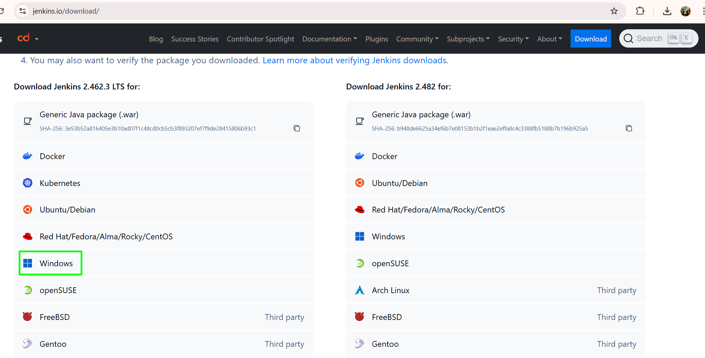
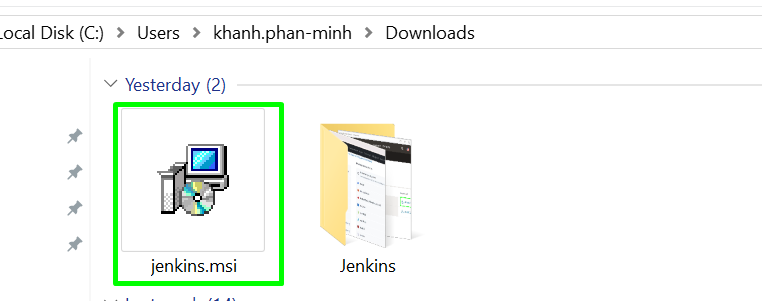

Cài đặt Jenkins trên Windows
=============================

Để cài đặt Jenkins trên Windows, bạn cần:
- Cài đặt Java: Jenkins được viết bằng Java, nên để chạy được bạn cần Java Development Kit (JDK) trước khi cài đặt Jenkins. Nếu máy bạn đã cài JDK vui lòng bỏ qua bước này.
- Cài Jenkins.

1. Cách cài đặt Java
~~~~~~~~~~~~~~~~~~~~~~~~~~~~~
Nếu chưa cài JDK, bạn có thể tham khảo bài viết `Cài JDK trên Window <https://www.oracle.com/java/technologies/downloads/#java11-windows>`_ để cài đặt nó.

2. Cách cài đặt Jenkins
~~~~~~~~~~~~~~~~~~~~~~~~~~~~~

**Bước 1: Download Jenkins**

- Đi đến trang chính thức của Jenkins `Jenkins Download <https://www.jenkins.io/download/>`_
- Chọn "Windows" dưới mục "Long-Term Support Release" hoặc "Weekly Release" tùy thuộc vào nhu cầu của bạn.

- Sau khi download xong bạn chạy file cài đặt có đuôi .msi

**Bước 2: Cài đặt Jenkins**

- Bấm ``next`` để bắt đầu cài đặt

Làm theo hướng dẫn trên màn hình để hoàn tất cài đặt. Jenkins sẽ được cài đặt mặc định tại C:\Program Files (x86)\Jenkins trừ khi bạn chọn một thư mục khác.
Khởi động Jenkins:

Sau khi cài đặt, Jenkins sẽ chạy trên port mặc định là 8080.
Mở trình duyệt và nhập http://localhost:8080 để truy cập Jenkins.
Lần đầu tiên truy cập, bạn sẽ cần mở tệp initialAdminPassword trong thư mục Jenkins để lấy mật khẩu và nhập vào màn hình đăng nhập.